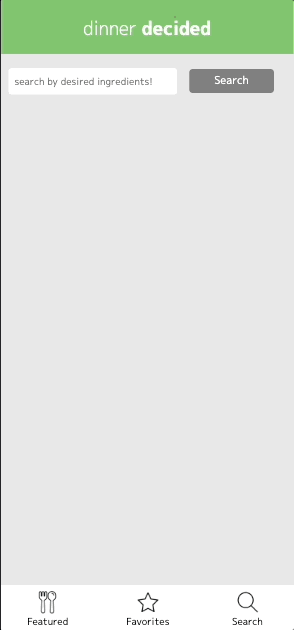
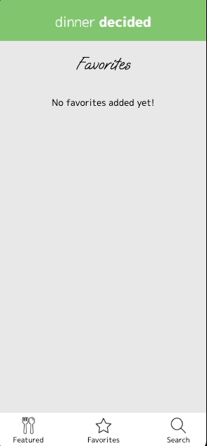

# dinner-decided

A web application for home cooks who want to explore food recipes.

## Why I Built This

This application solves the problem of leftover ingredients and meal indecisiveness.

## Live Demo

Try the application live at [https://wang-morris.github.io/ajax-project/]

## Technologies Used

- JavaScript
- HTML5
- CSS3
- Edamam Recipe Search API [https://developer.edamam.com/edamam-docs-recipe-api]

## Features
- User can view the featured meal.
- User can search for recipes by ingredients.
- User can add recipes to their favorites page.
- User can view added favorite recipes.

## Preview

## Stretch Features
- User can view a carousel a featured meals.
- User can edit or delete favorite meals.
